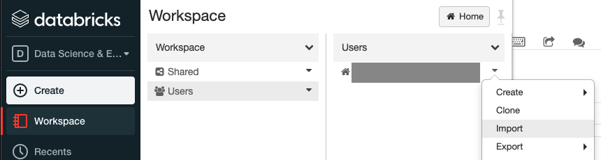

# CO2 IoT Device Data Generator
This exercise was created to help developers to think through a problem using the Scala Spark API (as opposed to solving the problem in only Scala).

## Quickstart
1. Clone this repository
2. Navigate to [Databricks Community Edition](https://community.cloud.databricks.com/), create an account, and log in
3. Import the [Databricks notebook: "Virtual CO2 Devices.dbc"](Virtual%20CO2%20Devices.dbc)

4. Follow instructions and fill out any `???`. Don't forget to run the tests!
5. When you're done, [view the solutions](./solutions/Virtual%20CO2%20Devices%20-%20Solutions.html)